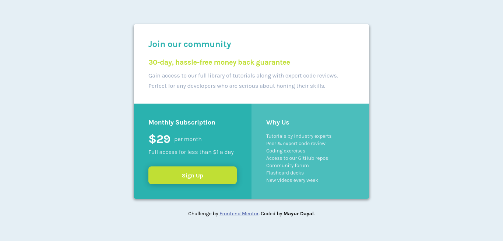

# Frontend Mentor - Single price grid component solution

This is a solution to the [Single price grid component challenge on Frontend Mentor](https://www.frontendmentor.io/challenges/single-price-grid-component-5ce41129d0ff452fec5abbbc). Frontend Mentor challenges helps in improving the coding skills by building realistic projects.

## The challenge

Users should be able to:

- View the optimal layout for the component depending on their device's screen size
- See a hover state on desktop for the Sign Up call-to-action

 

## Links

- Solution URL: [single-price-grid-component-solution](https://github.com/mayurDayal2000/single-price-grid-component)
- Live Site URL: [single-price-grid-component-preview](https://mayurdayal2000.github.io//single-price-grid-component/)

 

## Screenshots

#### Mobile Preview

 

#### Desktop Preview

 

### Author

- Frontend Mentor - [@mayurDayal2000](https://www.frontendmentor.io/profile/mayurDayal2000)
